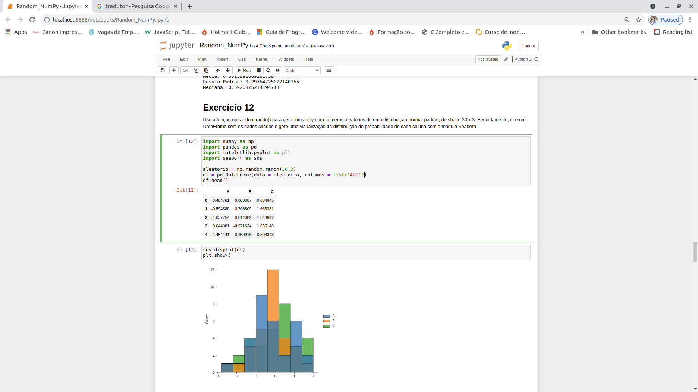

# Exercicios-com-NumPy
Nesse repositório resolvi mais de 50 exercícios da biblioteca NumPy, reforçando o conhecimento na utilização dos métodos e funções para gerar arrays aleatórios  com a biblioteca Random e pelos métodos de álgebra linear.

